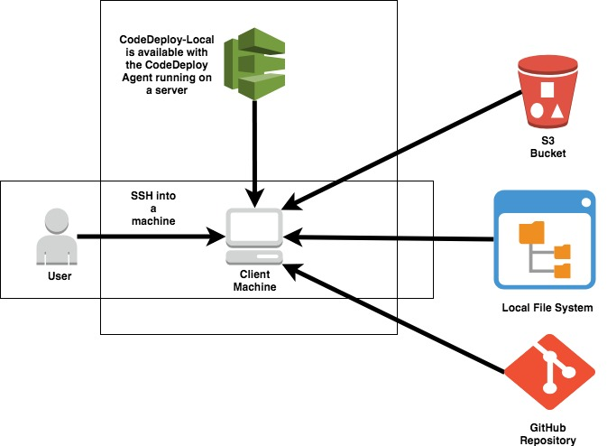

# Deploy-a-sample-wab-application
Using terraform create a environment for deploy a sample web application and launch a application.

*What is terraform ?*
Terraform is an infrastructure-as-code software tool created by HashiCorp. Users define and provide data center infrastructure using 
a declarative configuration language known as HashiCorp Configuration Language,

